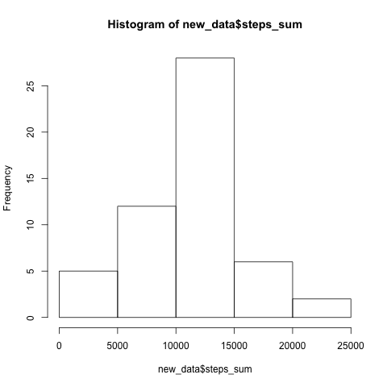
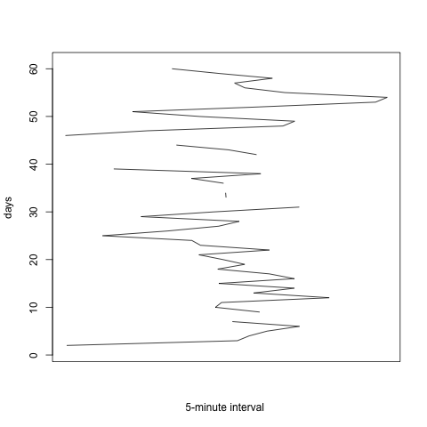
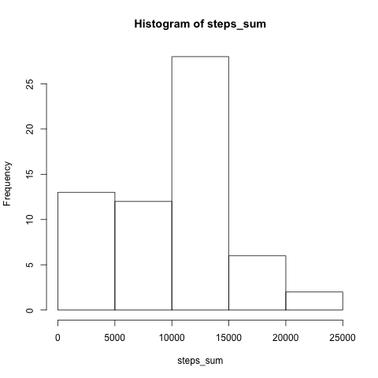
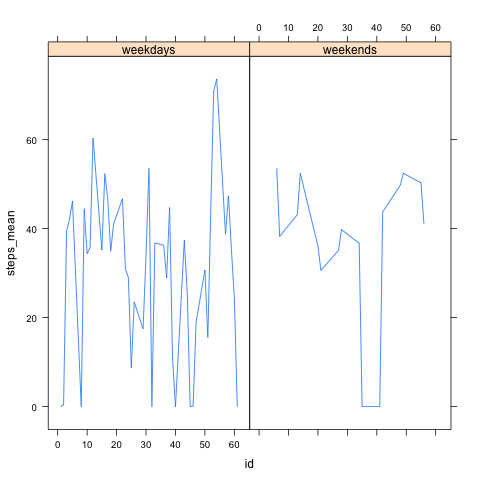

# Reproducible Research: Peer Assessment 1

## Loading and preprocessing the data

The code for loading the data is

> activity <- read.csv("~/Desktop/MOOC/Reproducible Research/activity.csv")

Since the data is interpreted as data.frame, there's no point doing preprocessing.

## What is mean total number of steps taken per day?

"the new data set has a mean for total steps as NA and a median for total steps as NA"

## What is the average daily activity pattern?

For the 5 minnute interval which has maximum number of steps, the result is listed as below
steps      date intervals
806 2012-11-27       615

For the date which has the maximum total number of steps, the result ilisted below as:
Date          steps_mean   steps_sum
2012-11-23   73.59028     21194

## Imputing missing values

"the number of NAs in the data set is 2304"

The code for the stratergy is listed as:

> steps<-activity$steps
> View(steps)
> steps[is.na(steps)]=0
> steps_sum[is.na(steps_sum)]=0
> steps_mean[is.na(steps_mean)]=0

The code for creating new data set is

new_data2<-data.frame(dates,steps_mean,steps_sum)

"the new data set has a mean for total steps as 9354.22950819672 and a median for total steps as 10395"

The value differs from the testimates from the first part of the assignment;
the impact of imputing missin gdata on the estimates of the total daily number of steps means that NA values would not interfere with the calculation

##Are there differences inactivity patterns between weekdays and weekends?
> library(lattice)

> library(datasets)

> dummy1<-as.vector(dates)

> dummy2<-as.Date(dummy1)

> days<-weekdays(dummy2)

> data_frame<-data.frame(days,steps_mean)

> weekdays<-c('Monday','Tuesday','Wednesday','Thursday','Friday')

> weekends<-c('Saturday','Sunday')

> test<-days

> test[test %in% weekdays] = 'weekdays'

> test[test %in% weekends] = 'weekends'

> id<-c(1:61)

> test_frame<-data.frame(test,steps_mean,id)

> library(lattice)

 
